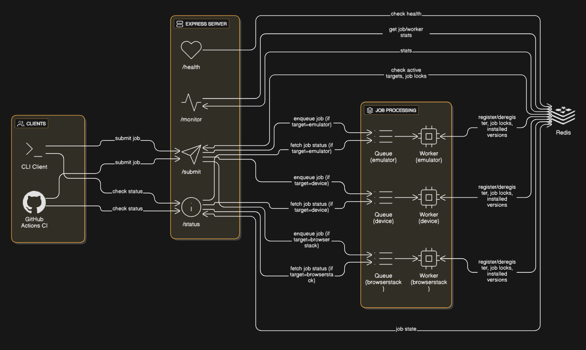

# Distributed App Test Infrastructure Simulation

A CLI tool and backend service for queuing, grouping, and deploying AppWright tests across local devices, emulators, and BrowserStack with GitHub Actions integration.

## Architecture Overview



## Key Features

### **Efficient Job Grouping**

- Jobs with the same `app_version_id` are grouped to minimize app installations
- Redis tracks installed versions per worker to avoid redundant installs

### **Smart Target Assignment**

- Workers register their target type (emulator/device/browserstack) in Redis
- Jobs are only assigned to workers with matching target capabilities

### **Reliability & Fault Tolerance**

- Automatic job retries (3 attempts by default)
- Job deduplication using Redis locks
- Crash recovery through persistent Redis queue

### **Priority System**

- Organization-based priority: `qualgent` (1) > `internal` (2) > `default` (5)
- Jobs processed in priority order within each target type

### **Monitoring**

- Real-time job status tracking
- Queue monitoring endpoints
- Detailed job execution logs

## Setup Instructions

### Prerequisites

- Node.js 18+ and pnpm
- Redis server running on localhost:6379
- Git for version control

### Installation

1. **Clone the repository:**

```bash
git clone https://github.com/Anshul439/jobcli
cd jobcli
```

2. **Install dependencies:**

```bash
pnpm install
```

3. **Start Redis Server:**

```bash
# Using Docker
docker run -d -p 6379:6379 redis:alpine
```

4. **Build the project:**

```bash
pnpm run build
```

5. **Start the backend server:**

```bash
pnpm run dev
```

6. **Start workers (in separate terminals):**

```bash

# Emulator worker
pnpm worker:emulator

# Device worker
pnpm worker:device

# BrowserStack worker
pnpm worker:browserstack
```

## Usage

### CLI Commands

### **Submit a test job**

```bash
 jobcli submit --org-id=randomorg --app-version-id=xyz3 --test=tests/logout.js --target=emulator
```

### Parameters

- `--org-id`: Organization identifier (affects priority)
- `--app-version-id`: App version for grouping installations
- `--test`: Path to test file
- `--target`: Target device type (`emulator` / `device` / `browserstack`)

### **Check job status**

```bash
jobcli status --job-id=<job-id>
```

### API Endpoints

### **Submit Job**

**POST** `/submit`  
**Content-Type**: `application/json`

```json
{
  "org_id": "qualgent",
  "app_version_id": "xyz123",
  "test_path": "tests/onboarding.spec.js",
  "target": "emulator"
}
```


### **Get Job Status**

```bash
GET /status/<job-id>
```

### **Monitor Queue**

```bash
GET /monitor/jobs/summary    # Get job counts by status
GET /monitor/jobs/queue      # Get detailed queue information
```

## How Grouping & Scheduling Works

### 1. Job Submission

- Jobs are submitted with `app_version_id`, `test_path`, and `target`
- Redis lock prevents duplicate submissions: `joblock:{org_id}:{app_version_id}:{test_path}:{target}`
- Jobs are queued with organization-based priority

### 2. Target-Based Worker Assignment

- Workers register their target type in Redis set: `active_targets`
- Jobs are only processed by workers matching the target type
- If no worker is available for the target, submission fails immediately

### 3. App Version Grouping

- Workers check if `app_version_id` is already installed (tracked in `installed_versions`)
- First job triggers installation (simulated 1s delay)
- Subsequent jobs skip installation

### 4. Job Processing Flow

Job Submitted → Queue (Priority) → Worker Match → Install Check → Test Execution → Cleanup

## GitHub Actions Integration

The workflow in .github/workflows/test.yml provides complete CI/CD integration:

### Features

- **Automatic Testing**: Triggers on push/PR to main branch
- **Service Dependencies**: Starts Redis service automatically
- **Build & Deploy**: Compiles TypeScript and starts services
- **Job Submission**: Uses CLI to submit test jobs
- **Status Polling**: Monitors job completion with timeout
- **Failure Handling**: Fails build if tests fail

Workflow Steps

Checkout code and setup Node.js
Install dependencies and build project
Start Redis service
Launch backend server and worker processes
Submit test job via CLI
Poll job status until completion/failure
Report results

## End-to-End Test Example

1. **Start all services:**

```bash
# Terminal 1: Backend server
pnpm run dev

# Terminal 2: Emulator worker
pnpm worker:emulator

# Terminal 3: Device worker
pnpm worker:device

# Terminal 4: Browserstack worker
pnpm worker:browserstack
```

2. **Submit multiple jobs**

```bash
# Submit jobs for same app version (will group installations)
jobcli submit --org-id=qualgent --app-version-id=v1.0.0 --test=tests/login.spec.js --target=emulator
jobcli submit --org-id=qualgent --app-version-id=v1.0.0 --test=tests/login.spec.js --target=emulator

# Submit job for different app versions
jobcli submit --org-id=internal --app-version-id=v2.0.0 --test=tests/checkout.spec.js --target=device
jobcli submit --org-id=internal --app-version-id=v2.0.0 --test=tests/checkout.spec.js --target=browserstack
```

3. **Monitor progress**

```bash
# Check specific job status
jobcli status --job-id=<job-id>

# Monitor queue
curl http://localhost:3000/monitor/jobs/summary
curl http://localhost:3000/monitor/jobs/queue
```

## Tech Stack

- **Language**: Node.js with TypeScript
- **CLI Framework**: Commander.js
- **Backend**: Express.js
- **Queue System**: BullMQ with Redis
- **Database**: Redis (for job storage)
- **CI/CD**: GitHub Actions
- **Package Manager**: pnpm

## Scalability Considerations

### Current Implementation

Single Redis instance for job queue and caching
Horizontal worker scaling by target type
Organization-based priority system
In-memory job deduplication
